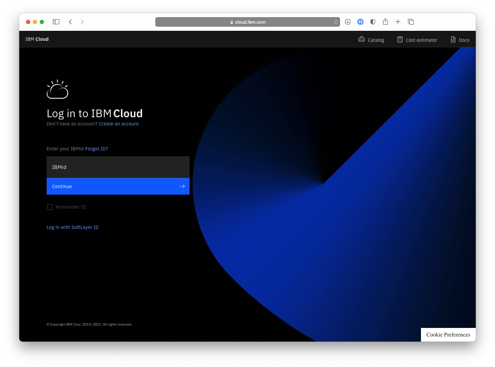
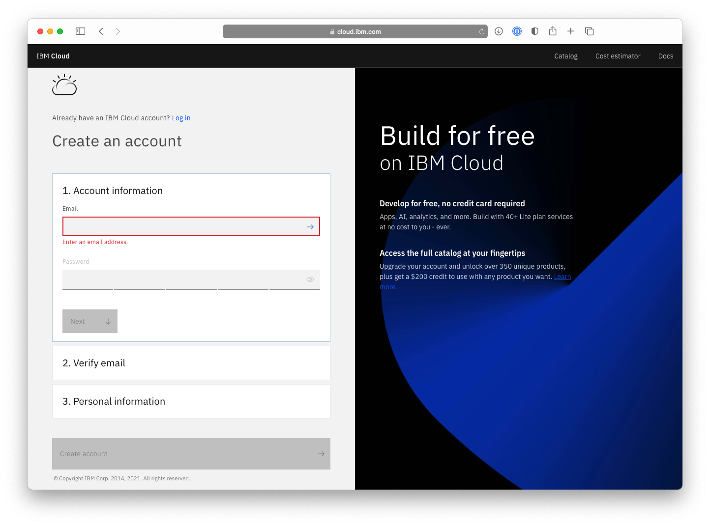
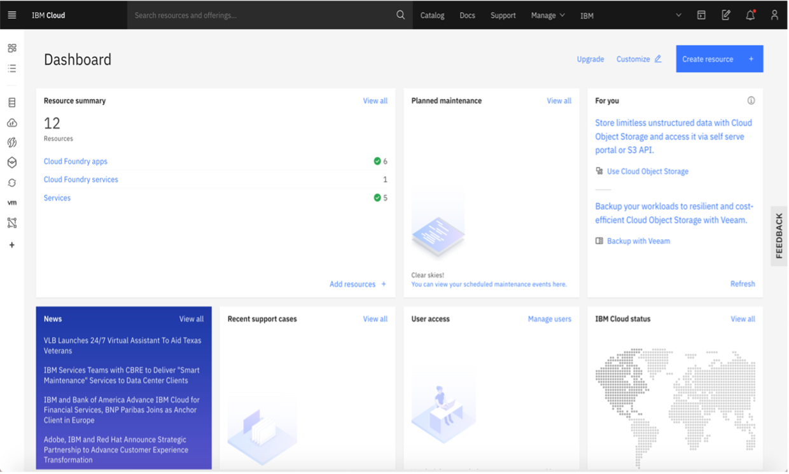

# How to access IBM Cloud

## What is IBM Cloud?
Provides over 190 services that allow you to build and customize your applications. The catalog provides free services in networking, containers, computing, analytics, machine learning, blockchain, databases, devops, internet of things, security and mobile. You can use the dashboard or the CLI (Command Line Interface) to create and work with these services. 
 
## How do I sign up?
Sign up for a **free** IBM Cloud account [here](https://ibm.biz/BdqTjv)

## Is it free?
A lot services on IBM Cloud have the lite tier, that you can use with your free IBM Cloud account. Lite accounts 
- don't have an expiration date, don't require a credit card and 
- provide limited access to a catalog of more than 40 services, 
- including IBM Watson® APIs.

## Step 1 - Visit [cloud.ibm.com](cloud.ibm.com) and click on **Create an account**

## Step 2 - Enter the required details in the registration form.
_Note: You must share a valid email address, IBM Cloud will send you a confirmation email to verify your account._  
_Note: The **Create account** button will be activated once you enter the required  information._

## Step 3 - Complete any additional steps as prompted and register your account through the confirmation email sent to your registered email ID.

## Step 4 - Log back into IBM Cloud (https://cloud.ibm.com). You will be directed to the dashboard where you can find the resources summary, IBM Cloud status, and other general information.  

IBM Cloud documentation is available at [cloud.ibm.com/docs](https://cloud.ibm.com/docs). If you want to just browse or visit, it doesn't require a registered account to access.