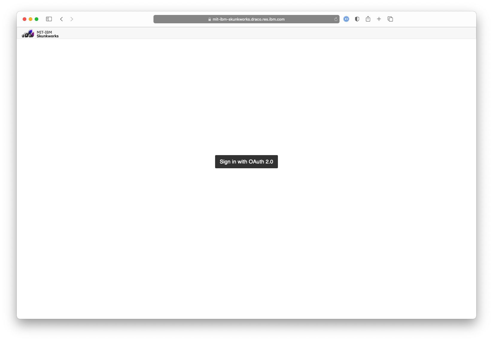
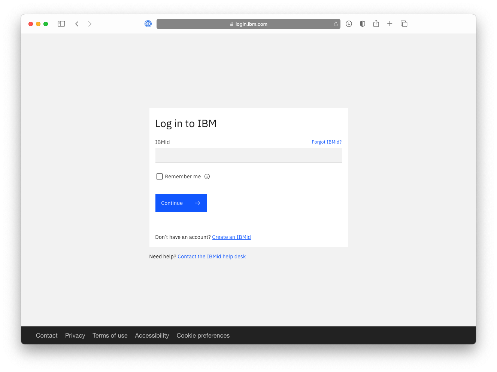
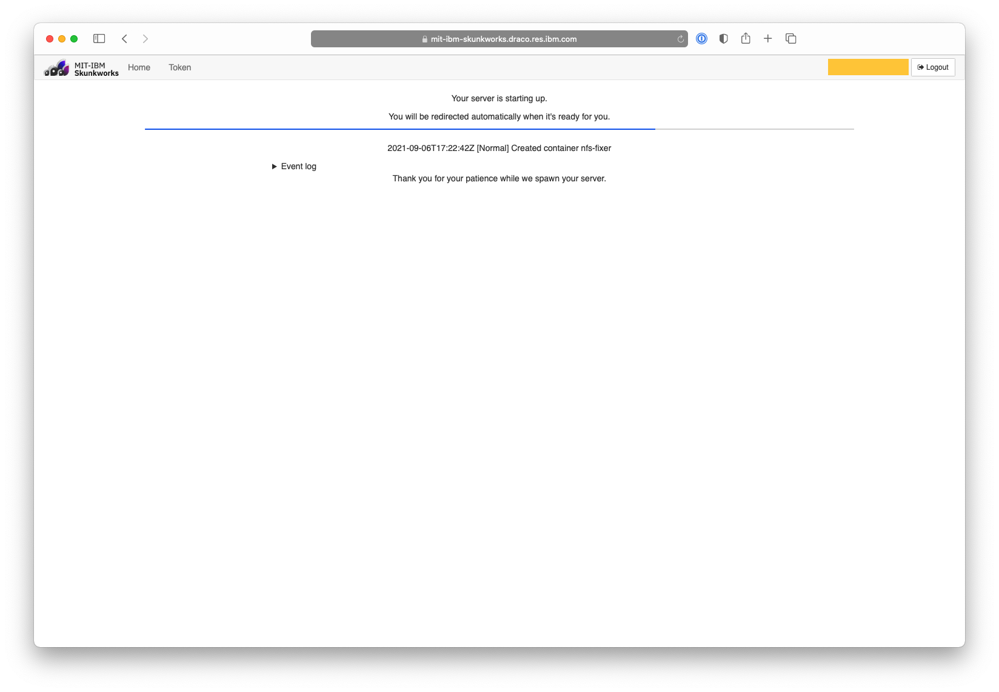
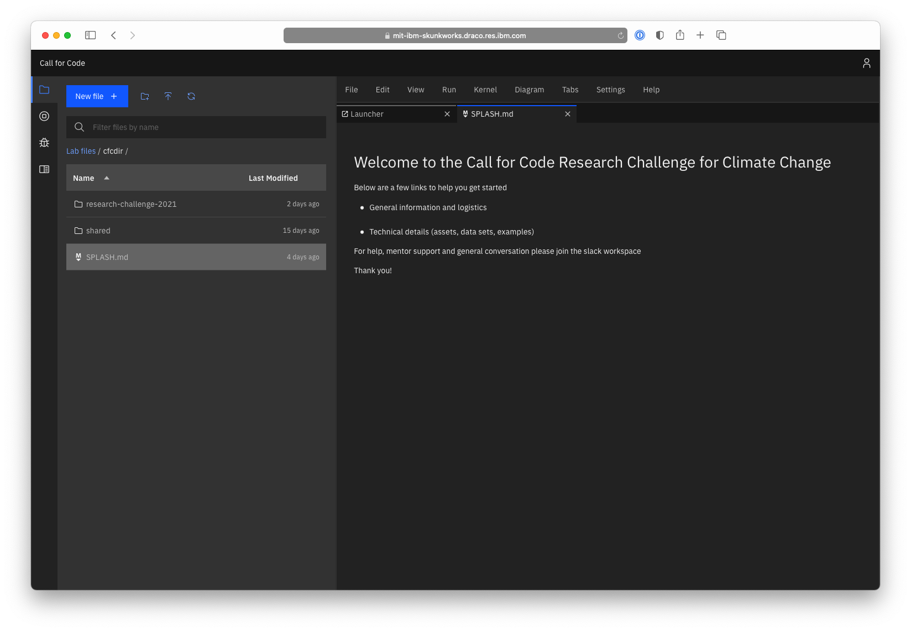

# How to access the Jupyter notebook environment

### Step 1 - Visit the following URL [ibm.biz/cfcnotebook](ibm.biz/cfcnotebook) then click on the 'Sign in with OAuth 2.0' button

### Step 2 - Click on the 'Login with IBMid' button and enter in your IBMid credentials
*Note: Only email addresses registered for the 2021 Call for Code Research Challenge will have access.  Post a message in the #helpdesk Slack channel for assistance in getting access*

### Step 3 - Select your server option and click on 'Start'
_Note: Most users will only see one option here_

### Step 4 - Wait while your Jupyter instance is being initiated
_Note: this may make a few minutes and may include an empty white screen.  No need for alarm, you will shortly be presented with the Jupyter environment._

### Step 5 - Take advantage of a few examples and create the next great thing to solve problems around climage change!

For any questions, please post a message on the #helpdesk channel in the Slack workspace.