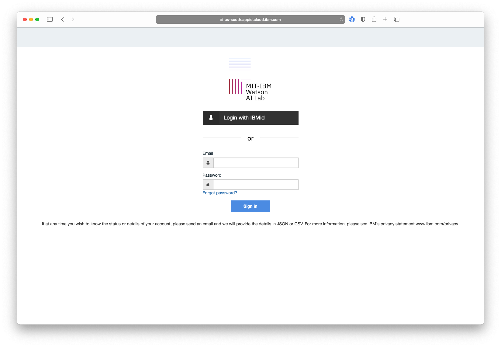
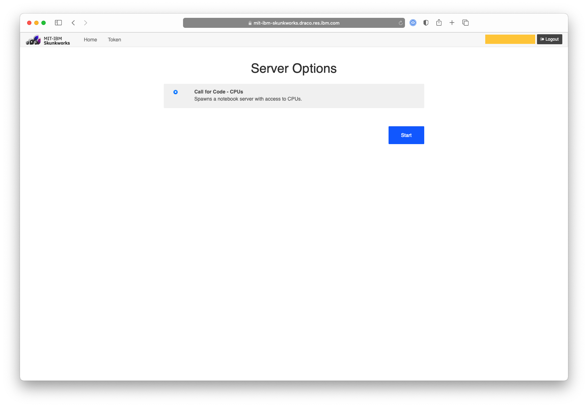

# Getting Started

Quick Links
- How to access the Jupyter notebook environment

## How to access the Jupyter notebook environment
### Step 1 - Visit the following URL ibm.biz/cfcnotebook then click on the 'Sign in with OAuth 2.0' button

### Step 2 - Click on the 'Login with IBMid' button and enter in your IBMid credentials
*Note: Only email addresses registered for the 2021 Call for Code Research Challenge will have access.  Post a message in the ??????? Slack channel for assistance in getting access*

