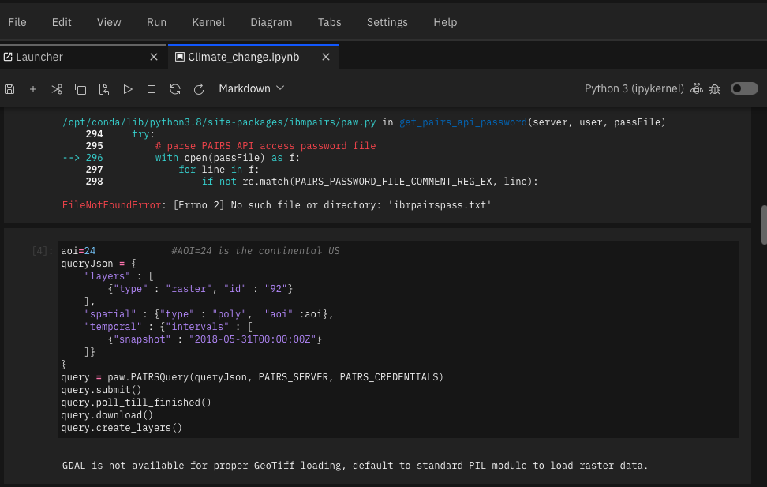
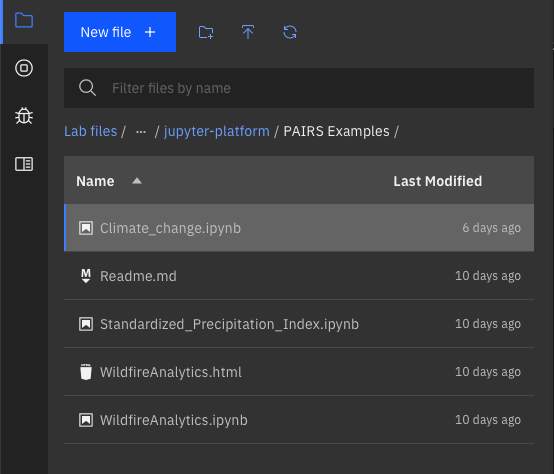

# Welcome to the CFC Research Challenge - Jupyter Environment

Our jupyter notebook environement is available at [ibm.biz/cfcnotebook](http://ibm.biz/cfcnotebook).  A set of step-by-step instructions on how to access the environment are available [here](https://github.com/academic-initiative/research-challenge-2021/blob/main/jupyter-platform/how-to-access.md)

We'll start with a very quick tour of the Jupyter Interface for those who may not be familiar with JupyterHub.  The Jupyter Environment is made of two primary components.  The main editing window

And the file navigation area where you can upload, rename, copy, delete the files you are working with.

## IBM Pairs
IBM PAIRS is the [Geospatial Analytics component](https://www.ibm.com/products/environmental-intelligence-suite/geospatial-analytics)  of the [IBM Environmental Intelligence Suite](https://www.ibm.com/products/environmental-intelligence-suite) It has a very rich set of geo-spatial-temporal datasets and analytics tools

- [PAIRS User Interface](https://pairs.res.ibm.com/tutorial/tutorials/gui/index.html)  - Powerful user interface thatcan be used to view data sets, data layers and analytics results
- [PAIRS API Interface](https://pairs.res.ibm.com/tutorial/tutorials/api/index.html#) - API used to access PAIRS Data, Layers and Analytics Functions progrmatically
- [PAIRS Datasets and Data Layers Overview](https://github.com/academic-initiative/research-challenge-2021/blob/main/jupyter-platform/PAIRSLayersAndLevelsOverview.pdf)
  - [PAIRS Data Sets](https://github.com/academic-initiative/research-challenge-2021/blob/main/jupyter-platform/EIS%20DataSet%20Report%20July%202021.pdf) - Large collection of open and proprietary geo-spatial-temporal data sets available in PAIRS
  - [PAIRS Data Layers](https://github.com/academic-initiative/research-challenge-2021/blob/main/jupyter-platform/EIS%20Detail%20Data%20Layer%20Report%20July%202021.pdf) - large collection of visualization layers that can be used in the PAURS UI and in queueries.
- PAIRS Start here Notebook Examples - Simple subset of Jupyter notebook examples of PAIRS API usage
- [PAIRS Example Notebook Archive](https://github.ibm.com/physical-analytics/pairs-applications) - Large collection of Jupyter notebooks examples of PAIRS API usage

## Weather Company

NEEDED

LINK TO API
LINK TO DOCS

## Getting help

In the Slack workspace, you’ll be able to find other participants, join or build teams, brainstorm and collaborate on ideas, and communicate with the challenge Champions and Subject Matter Experts for mentoring and technical guidance. [Join the Slack](https://join.slack.com/t/callforcodere-ju79661/shared_invite/zt-uc2w9nn4-zEf9urnpE1c7~EIGJblx_Q)

Please join the following channels in the workspace:

[#2021-research-challenge](https://callforcode-research.slack.com/archives/C02BVGGJDJ7)

For more information regarding logistics, submissions, judging etc. Please visit our main page at [ibm.biz/cfc-research-challenge](https://ibm.biz/cfc-research-challenge)
